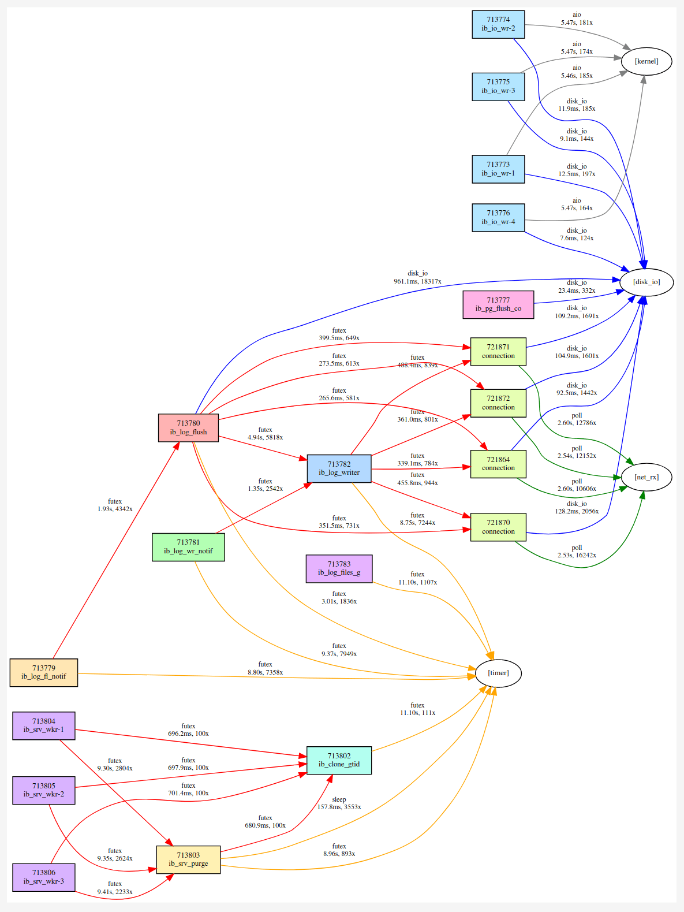

# btrace

btrace profiles thread **blocking/wakeup relationships** in multithreaded Linux applications. It answers: _which threads block, why, for how long, and who wakes them_ — building a dependency graph that reveals bottlenecks invisible to per-thread profilers.

Below is a dependency graph of a MySQL server under sysbench OLTP workload (read-write, 4 connections, 10 seconds), generated by btrace. Each node is a thread or kernel wake source; edges show **waiter → blocker** relationships. The interactive version lets you click any edge to inspect the blocked and waker call stacks.

*Click the image to open interactive html*

<a href="https://cyb70289.github.io/btrace/assets/mysql.html"></a>

## How It Works

btrace uses BPF tracepoints on `sched_switch` and `sched_waking` to correlate blocker and waker in-kernel, producing per-pair data with very low overhead.

It operates in two phases: **in-kernel recording** and **offline analysis**.

### Recording

1. **BPF probes** (`src/bpf/btrace.bpf.c`): Two tracepoints are attached:
   - `sched_switch`: When a target thread is switched out with a non-running state, btrace captures its kernel and user stack, timestamp, and state into a BPF hash map (`blocked_map`).
   - `sched_waking`: When any thread wakes a blocked target thread, btrace looks up the saved state, computes the block duration, captures the waker's stacks, and emits a `block_wake_event` through a perf buffer.

2. **Userspace collection** (`src/record.c`): A `perf_buffer__poll` loop receives these events and writes them to a `.btrace` file via `bt_writer`, resolving stack traces at the end of recording.

### Analysis

1. **Report generation** (`src/report.c`): Reads the `.btrace` file, categorizes each block-wake pair by analyzing kernel stack function names (e.g., `futex_wait` → futex, `ep_poll` → poll), aggregates per-thread statistics and dependency edges, and prints a text report.

2. **Visualization**: The `--dot` flag produces a DOT dependency graph, and `scripts/btrace2html.py` converts it to an interactive HTML report where clicking an edge reveals blocked and waker stacks.

## NOTES

> btrace intentionally ignores threads created *after* recording starts, as well as blocking events where the wakeup did not occur before recording stopped. The thread list is a snapshot taken at record start.

> The report (`src/report.c`) categorizes blocking and wakeup reasons by matching kernel stack function names (at most 12 frames) against heuristics. These heuristics depend on kernel symbol names. They are incomplete and may be fragile across kernel versions.

## Build

### System Requirements

- Linux kernel >= 5.8 (with BTF support enabled)
- `clang` (for compiling BPF programs)
- `libbpf-dev`, `libelf-dev`, `zlib1g-dev`
- `bpftool` (for vmlinux.h generation and BPF skeleton)
- `graphviz` (for SVG output from DOT)
- `python3` (for HTML report generation)

### Install packages (Ubuntu)

```bash
sudo apt install clang libbpf-dev libelf-dev zlib1g-dev linux-tools-$(uname -r) graphviz python3
```

### Generate vmlinux.h

The first build step is generating `vmlinux.h` from the running kernel's BTF info:

```bash
make vmlinux
```

This runs `bpftool btf dump file /sys/kernel/btf/vmlinux format c > src/include/vmlinux.h`.

### Build btrace

```bash
make
```

This compiles the BPF program, generates the skeleton header, and builds the `btrace` binary.

## Tests

### Unit test cases

Five test workloads cover the key blocking patterns:

| Test | Blocking Type | Expected Category | Report |
|------|--------------|-------------------|-------------|
| `test_mutex` | pthread_mutex contention | futex | [mutex.html](https://cyb70289.github.io/btrace/assets/mutex.html) |
| `test_condvar` | pthread_cond wait/signal | futex | [condvar.html](https://cyb70289.github.io/btrace/assets/condvar.html) |
| `test_disk_io` | write + fsync + read | disk_io | [disk_io.html](https://cyb70289.github.io/btrace/assets/disk_io.html) |
| `test_net_read` | blocking recv on TCP socket | net_io | [net_read.html](https://cyb70289.github.io/btrace/assets/net_read.html) |
| `test_epoll` | epoll_wait on timerfd | epoll | [epoll.html](https://cyb70289.github.io/btrace/assets/epoll.html) |

Build and run all test cases:

```bash
make test-cases
make check
```

This compiles the test binaries, profiles each one with btrace, generates text + DOT + SVG + HTML reports, and verifies that the expected blocking categories appear. Artifacts are saved under `./out/`.

### MySQL e2e test

End-to-end profiling of a real MySQL server under sysbench OLTP workload, including overhead measurement.

Prerequisites:

```bash
sudo apt install mysql-server sysbench
sudo systemctl start mysql
```

For symbol resolution, install the debug symbols package:

```bash
sudo apt install mysql-server-core-8.0-dbgsym
```

Run:

```bash
bash tests/run_mysql_e2e.sh
```

This script:

1. Prepares a sysbench OLTP dataset
2. Runs a baseline benchmark (no tracing)
3. Runs the same benchmark with btrace attached to mysqld
4. Generates text + DOT + SVG + HTML reports in `./out/mysql/`
5. Reports TPS for both runs and btrace overhead percentage
6. Verifies mysqld function name resolution

## Usage

### Record

Attach btrace to a running process and collect blocking events:

```bash
sudo btrace record -p <PID> [-o <output.btrace>] [-d <sec>]
```

Options:
- `-p <PID>` — target process PID (required)
- `-o <file>` — output file (default: `btrace.btrace`)
- `-d <sec>` — duration in seconds (default: until Ctrl+C)

Press Ctrl+C (or send SIGINT) to stop recording.

Example — profile a MySQL server:

```bash
sudo btrace record -p $(pidof mysqld) -o mysql.btrace
```

Example — profile for 10 seconds:

```bash
sudo btrace record -p $(pidof mysqld) -d 10 -o mysql.btrace
```

### Report

Analyze a recorded `.btrace` file and generate reports:

```bash
btrace report -i <file.btrace> [-o <output_dir>] [--dot] [--min-count N] [--min-time Ms]
```

Options:
- `-i <file>` — input .btrace file (required)
- `-o <dir>` — output directory (default: current directory)
- `--dot` — also generate a DOT dependency graph
- `--min-count N` — only include edges that occurred at least **N** times (default: **10**)
- `--min-time Ms` — only include edges whose total block duration is at least **Ms** milliseconds (default: **1**)

Example:

```bash
btrace report -i mysql.btrace -o out/mysql --dot
```

This produces:
- `btrace.txt` — text report with thread summary, blocking reasons, and top stacks
- `btrace.dot` — DOT dependency graph (when `--dot` is used)
- `btrace_stacks.json` — stack data for HTML interactivity

**Tip**: Raising `--min-count` or `--min-time` filters out rare, noisy edges and makes the high-level bottlenecks stand out.

### Output formats

#### Text

The text report shows thread summaries, per-thread blocking reasons, dependency edges, and top blocking stacks.

#### DOT / SVG

Convert the DOT graph to SVG:

```bash
dot -Tsvg out/mysql/btrace.dot > out/mysql/btrace.svg
```

Edge direction: **waiter → blocker** (follow arrows to root cause).

#### Interactive HTML

Generate an interactive HTML page with clickable edges:

```bash
python3 scripts/btrace2html.py out/mysql/btrace.dot -o out/mysql/btrace.html
```

- **Click** an edge to see a popup with blocked and waker kernel + user stacks
- **Hover** a stack frame to see the source file and line number (when debug symbols are available)

## Project Structure

```
btrace/
├── docs/design.md          # Full design document
├── src/
│   ├── main.c              # CLI entry point (record / report)
│   ├── record.c/h          # BPF attach, perf event loop, .btrace writer
│   ├── report.c/h          # Text report, categorization, aggregation
│   ├── storage.c/h         # .btrace binary format reader/writer
│   ├── sym.c/h             # Symbol resolution (ELF, kallsyms, addr2line)
│   ├── dot.c/h             # DOT graph generation
│   ├── bpf/btrace.bpf.c    # BPF program (tracepoint handlers)
│   └── include/
│       ├── btrace.h        # Shared types, constants, event structs
│       └── vmlinux.h       # Generated from kernel BTF (make vmlinux)
├── scripts/
│   └── btrace2html.py      # DOT → interactive HTML converter
├── tests/
│   ├── run_test.sh         # Test suite runner
│   ├── run_mysql_e2e.sh    # MySQL e2e + overhead benchmark
│   └── cases/              # Test workload programs
└── Makefile
```

## Credits

- [OpenCode](https://opencode.ai) + [Superpowers](https://github.com/obra/superpowers)
- GLM-5.1 for planning and implementation
- KIMI-2.6 for code review and refinement
