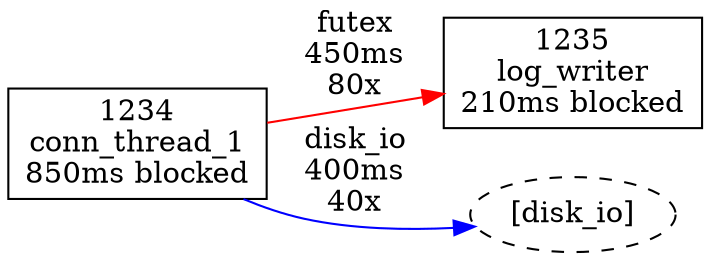

# btrace Design Document

## 1. Overview

btrace profiles thread blocking/wakeup relationships in multithreaded Linux applications.
It answers: *which threads block, why, for how long, and who wakes them* — building a
dependency graph that reveals bottlenecks invisible to per-thread profilers.

```
btrace record -p <PID> [-d <stack_depth>] [-o <file>]   # profile a process
btrace report -i <file> [-o <dir>]                       # analyze & visualize
```

## 2. Core Approach: BPF-Side Block/Wakeup Correlation

The key insight (from BCC's `offwaketime`) is to **pair block and wakeup in BPF**, not
in post-processing:

1. `sched_switch` fires with `prev_state != TASK_RUNNING` → thread is voluntarily
   blocking. Store its info in a per-TID BPF hash map (`blocked_map`).
2. `sched_waking` fires → look up the target TID in `blocked_map`. If found, emit a
   single **BLOCK_WAKE** event containing both blocker's and waker's stacks + duration.
   Delete from map.
3. At record end, any remaining entries in `blocked_map` become **BLOCK_ONLY** events.

This gives us per-pair data — who blocked, why (kernel stack), how long, who woke them,
why (waker's kernel stack) — with O(1) lookup and no post-hoc correlation.

## 3. Tracepoint Selection

Only 4 tracepoints. No syscall or block/net IO tracepoints — blocking reason and waker
identity are derived from kernel stacks.

| Tracepoint | Purpose | Key Fields |
|---|---|---|
| `sched:sched_switch` | Detect voluntary blocks | `prev_pid`, `prev_state`, `next_pid` |
| `sched:sched_waking` | Identify who woke whom | `common_pid` (waker), `pid` (target) |
| `sched:sched_process_fork` | Track new threads | `parent_pid`, `child_pid` |
| `sched:sched_process_exit` | Cleanup blocked_map | `pid` |

### Why no syscall/IO tracepoints?

The kernel stack at `sched_switch` already reveals the blocking path:
- `futex_wait_queue_me` → futex/mutex/condvar block
- `vfs_read` → block layer → disk IO block
- `ep_poll` → epoll block
- `tcp_recvmsg` → network read block

The waker's kernel stack at `sched_waking` reveals the wakeup source:
- `futex_wake` → `sys_futex` → direct thread wakeup
- `blk_update_request` → IRQ handler → disk IO completion
- `tcp_v4_rcv` → softirq → network event

This gives us categorization for free, with zero extra event volume.

### Future enhancement: futex uaddr tracking

Adding `sys_enter_futex`/`sys_exit_futex` tracepoints would let us correlate specific
mutex/condvar addresses between blocker and waker. Deferred — kernel stack
categorization is sufficient for the initial version.

## 4. BPF Program Design

### 4.1 Maps

```
stack_map:    BPF_MAP_TYPE_STACK_TRACE  (max_entries=16384)
              Deduplicated user+kernel stacks. bpf_get_stackid() returns an ID;
              identical stacks share the same ID.

blocked_map:  BPF_MAP_TYPE_HASH  (key=u32 tid, val=struct blocked_thread, max_entries=4096)
              Tracks currently-blocked target threads for wakeup correlation.

events:       BPF_MAP_TYPE_PERF_EVENT_ARRAY
              Streams correlated events to userspace.

target_map:   BPF_MAP_TYPE_ARRAY  (key=0, val=u32 target_tgid, max_entries=1)
              Single entry: the target process TGID. Set from userspace before attach.
```

### 4.2 blocked_thread value

```c
struct blocked_thread {
    u64 timestamp;       // bpf_ktime_get_ns() at block time
    u32 tgid;
    long prev_state;     // TASK_INTERRUPTIBLE, TASK_UNINTERRUPTIBLE, etc.
    int user_stack_id;   // from bpf_get_stackid(..., BPF_F_USER_STACK)
    int kern_stack_id;   // from bpf_get_stackid(..., 0)
    char comm[16];
};
```

### 4.3 Event emission

`sched_switch` handler:
```
tgid = bpf_get_current_pid_tgid() >> 32
if tgid != target_tgid: return           // filter: only target process
if prev_state == TASK_RUNNING: return    // involuntary preemption, skip
capture user + kernel stack IDs
blocked_map[prev_pid] = {timestamp, tgid, prev_state, stack_ids, comm}
```

`sched_waking` handler:
```
val = blocked_map.lookup(target_pid)
if !val: return                          // not our thread or not blocked
build block_wake_event:
  block time  = val->timestamp
  wake time   = bpf_ktime_get_ns()
  blocker info = val fields
  waker info  = common_pid, waker tgid, waker stacks, waker comm
bpf_perf_event_output(events, &evt)
blocked_map.delete(target_pid)
```

`sched_process_exit` handler:
```
blocked_map.delete(pid)   // cleanup orphaned entry
emit THREAD_EXIT event
```

`sched_process_fork` handler:
```
if parent_tgid == target_tgid:
  emit THREAD_CREATE event
```

## 5. Waker Identification & Categorization

`common_pid` in `sched_waking` is the current task when the wakeup fires. This is
correct for futex wakeups (it's the calling thread) but misleading for IO completions
(it's whatever task was running when the interrupt hit).

### Categorization (in report phase, from waker's kernel stack)

| Category | Waker Kernel Stack Pattern | Graph Node |
|---|---|---|
| Thread wakeup | `futex_wake` → `do_futex` → `sys_futex` | Waker thread |
| Disk IO completion | `blk_update_request`, IRQ handler | `[disk_io]` |
| Network event | `tcp_v4_rcv`, `netif_receive_skb`, softirq | `[net_rx]` |
| Timer | `hrtimer_interrupt` | `[timer]` |
| Signal | `send_signal` | `[signal]` |
| Other kernel | (default) | `[kernel]` |

### Blocking reason (from blocker's kernel stack at sched_switch)

| Category | Kernel Stack Pattern | prev_state |
|---|---|---|
| Futex (mutex/condvar) | `futex_wait_queue_me` | TASK_INTERRUPTIBLE |
| Disk IO | `vfs_read/write` → block layer | TASK_UNINTERRUPTIBLE |
| Network IO | `tcp_recvmsg`, `sk_wait_data` | TASK_INTERRUPTIBLE |
| Epoll | `ep_poll` | TASK_INTERRUPTIBLE |
| Sleep | `hrtimer_nanosleep` | TASK_INTERRUPTIBLE |
| Page fault | `handle_mm_fault` | TASK_UNINTERRUPTIBLE |
| IO uring | `io_uring_wait` | varies |
| Wait PID | `wait_task_child` | TASK_INTERRUPTIBLE |
| Signal wait | `do_sigsuspend` | TASK_INTERRUPTIBLE |

Additional blocking events beyond the original spec: io_uring, userfaultfd, pidfd_wait,
inotify/fanotify, vfork, GPU fence. All are automatically captured since they go through
`sched_switch` with `prev_state != 0` — just add stack pattern matching for categorization.

## 6. Record File Format (.btrace)

Custom binary, designed for fast sequential write during record and random-access read
during report.

```
┌─────────────────────────────────────┐
│ Header (256 bytes)                  │
│   magic[4] = "BTR1"                │
│   version: u32                      │
│   target_pid: u32                   │
│   start_time_ns: u64                │
│   end_time_ns: u64                  │
│   stack_depth: u32  (display depth) │
│   num_events: u64                   │
│   num_stacks: u32                   │
│   num_threads: u32                  │
│   events_off: u64                   │
│   stacks_off: u64                   │
│   threads_off: u64                  │
│   maps_off: u64                     │
│   kallsyms_off: u64                 │
│   reserved[152]                     │
├─────────────────────────────────────┤
│ Events (sequential, type-prefixed)  │
├─────────────────────────────────────┤
│ Stacks (stack_id → frame IPs)       │
├─────────────────────────────────────┤
│ Threads (tid/tgid/comm)             │
├─────────────────────────────────────┤
│ Maps (raw /proc/<pid>/maps)         │
├─────────────────────────────────────┤
│ Kallsyms (raw /proc/kallsyms)       │
└─────────────────────────────────────┘
```

### Event types

```c
#define EVT_BLOCK_WAKE   1   // correlated block + wakeup pair
#define EVT_BLOCK_ONLY   2   // thread blocked, never woken during recording
#define EVT_THREAD_CREATE 3
#define EVT_THREAD_EXIT   4
```

### BLOCK_WAKE event (104 bytes)

```c
struct block_wake_event {
    u64 timestamp;           // wake timestamp
    u64 block_timestamp;     // block timestamp
    u32 blocked_tid;
    u32 blocked_tgid;
    u32 waker_tid;           // common_pid from sched_waking
    u32 waker_tgid;
    u64 prev_state;
    s32 blocked_user_stack_id;
    s32 blocked_kern_stack_id;
    s32 waker_user_stack_id;
    s32 waker_kern_stack_id;
    char blocked_comm[16];
    char waker_comm[16];
};
```

### Stack entry

```c
struct stack_entry {
    s32 stack_id;
    u32 num_frames;
    u64 frames[];   // variable-length instruction pointers
};
```

### Thread entry

```c
struct thread_entry {
    u32 tid;
    u32 tgid;
    char comm[16];
};
```

## 7. Symbol Resolution

**User-space**: Parse ELF `.symtab`/`.dynsym` via libelf. Map virtual addresses to
function names using the saved `/proc/PID/maps` to locate the containing DSO, then look
up the nearest symbol ≤ address.

**Kernel-space**: Parse saved `/proc/kallsyms`.

**Source lines**: Shell out to `addr2line -e <binary> -f <addr>` for function name +
source file:line. Falls back to ELF symbol name if addr2line fails (stripped binary).

DSO cache avoids re-parsing the same binary.

## 8. Report Output

### 8.1 Text Report

```
=== btrace report ===
Target PID: 1234  Duration: 10.5s  Stack depth: 8

Thread Summary:
  TID    Name           Blocks  Total Wait  Avg Wait
  1234   conn_thread_1  120     850ms       7.1ms
  1235   log_writer     45      210ms       4.7ms
  1236   io_thread_1    30      1500ms      50ms

Blocking Reasons (thread 1234 - conn_thread_1):
  futex:    450ms (80x)   [pthread_mutex_lock → process_request]
  disk_io:  400ms (40x)   [vfs_read → ext4_file_read_iter]

Thread Dependency Graph (waiter → blocker):
  conn_thread_1 → log_writer:    450ms (80x)  [futex]
  conn_thread_1 → [disk_io]:     400ms (40x)
  log_writer → [disk_io]:        210ms (45x)

Top Blocking Stacks (thread 1234 - conn_thread_1):
  #0  pthread_mutex_lock   /lib/libpthread.so
  #1  process_request      /usr/bin/mysqld:main.cc:142
  #2  handle_connection    /usr/bin/mysqld:conn.cc:58
```

### 8.2 DOT Graph

Edge direction: **waiter → blocker** (dependency graph — follow arrows to root cause).



Edge colors: futex=red, disk_io=blue, network=green, epoll=orange, other=gray.

## 9. Test Workloads

Five test cases covering the key blocking patterns, each generating verifiable
block/wakeup relationships:

| Test | Blocking Type | Expected Observation |
|---|---|---|
| `test_mutex` | pthread_mutex_t contention | Multiple threads blocked on futex, waker = lock holder |
| `test_condvar` | pthread_cond_t wait/signal | Consumer blocked on futex, waker = producer |
| `test_disk_io` | write + fsync + read | TASK_UNINTERRUPTIBLE block, waker = `[disk_io]` |
| `test_net_read` | blocking recv on socket | TASK_INTERRUPTIBLE block, waker = `[net_rx]` |
| `test_epoll` | epoll_wait on timerfd | TASK_INTERRUPTIBLE block, waker = `[timer]` |

All tests use max 8 threads. MySQL e2e uses mysql server running on host
with sysbench OLTP workload.

## 10. Risks & Mitigations

| Risk | Mitigation |
|---|---|
| Waker misidentification for IO completions (common_pid = random task) | Kernel stack heuristic: if waker stack shows IRQ/softirq → use `[disk_io]`/`[net_rx]` special node |
| Lost perf events under high load | 4MB+ per-CPU perf buffer; report dropped count; user can increase buffer |
| Kernel stack unavailable (no frame pointers) | Check at startup; fall back to user stack; print warning |
| Stripped binaries → no source lines | addr2line fails gracefully; fall back to .dynsym function names |
| BPF map overflow | Use generous sizes (blocked_map=4096, stack_map=16384); report pressure |
| sched_waking for already-runnable threads | blocked_map only contains blocked threads; lookup miss = ignore |
